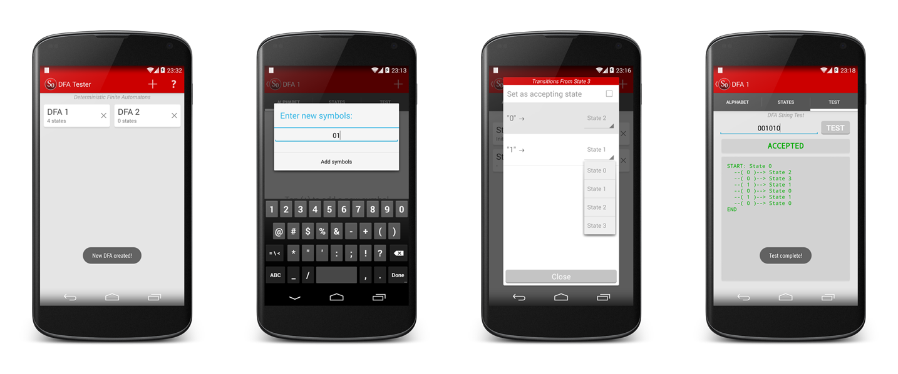

DFA Tester
=

A deterministic finite automaton (DFA) tester that allows users to build DFAs and test them.

For each DFA created in the application, users can:
<ul>
<li>Define their own alphabet</li>
<li>Define states and set their transitions</li>
<li>Test if a string is accepted or rejected by the DFA</li>
</ul>

<div align="center">
	</p>
	
	<a href="https://play.google.com/store/apps/details?id=com.seedform.dfatester">
      
   </a>
</div>

<br>

Project Import Instructions
=

In Eclipse:
<ol>
<li>Import the <b>DFATester</b> project into your Eclipse workspace.</li>

<li>Add <b>android-support-v7-appcompat</b> as a (library) project in Eclipse (if you haven't yet, download the Android Support Library using the Android SDK Manager).</li>

<li>Add <b>android-support-v7-appcompat</b> as a library in <b>DFATester</b> (Project properties -> Android).</li>
</ul>
</ol>

<br>

License
=
```
Copyright 2013 Shudmanul Chowdhury

Licensed under the Apache License, Version 2.0 (the "License");
you may not use this file except in compliance with the License.
You may obtain a copy of the License at

   http://www.apache.org/licenses/LICENSE-2.0

Unless required by applicable law or agreed to in writing, software
distributed under the License is distributed on an "AS IS" BASIS,
WITHOUT WARRANTIES OR CONDITIONS OF ANY KIND, either express or implied.
See the License for the specific language governing permissions and
limitations under the License.
```
